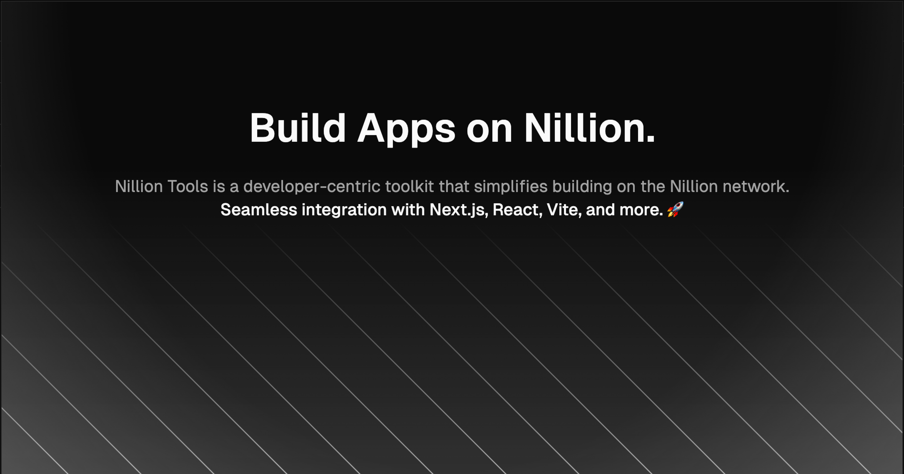

  

Nillion Tools is a developer-centric toolkit that simplifies building on the Nillion network. It includes various packages that help developers interact with the Nillion network, build dApps, manage Ed25519 Keys and more.

---

## Packages

- **`Key Manager`**: Key Manager is a tool to manage and authenticate Ed25519 keys. It provides a simple workflow to create, import, and export keys. It also provides a way to authenticate keys using WebAuthn and FIDO2.
- **`Connect Kit`(coming soon...)**: Connect Kit is a wallet connect library that helps you connect your dApp to the Nillion network.

---

## Documentation

For a complete overview of available functions and usage examples, please refer to the official documentation: [https://nillion-tools.envoy1084.xyz](https://nillion-tools.envoy1084.xyz/docs/key-manager)

API docs are available at: [https://nillion-tools.envoy1084.xyz/api-docs](https://nillion-tools.envoy1084.xyz/api-docs)

---

# Contributing

We welcome contributions! Check out our [contributing guide](./CONTRIBUTING.md) for more information

---
